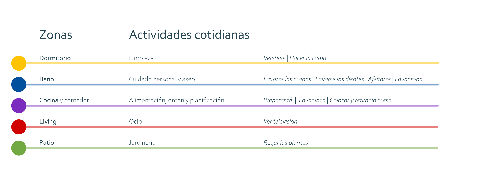

# Lectogram

## Apoyo a la interpretación de pictogramas

[Para ingresar al repositorio de GitHub de Lectogram haga click aquí](https://github.com/accesibilidad-inclusion/lectogram/tree/gh-pages)

Lectogram consiste en un apoyo tecnológico, que facilita la comprensión de los espacios que lo rodean, identificando lugares específicos y objetos con los que pueden realizar actividades de la vida cotidiana, mediante apoyos visuales y auditivos. El apoyo visual consiste en **un set de pictogramas** diseñados específicamente para personas con discapacidad intelectual, enfocado en las tareas del hogar. El apoyo auditivo funciona a través de un objeto portable que al interactuar con el pictograma entrega un mensaje que ayuda a la realización de distintas actividades relacionadas con los objetos presentes. El objeto lector de pictogramas se piensa como un objeto portable y manipulable para el usuario ya que este se tiene que acercar y tener contacto con él pictogramas para su activación y entregar el apoyo auditivo instructivo de como hacer las actividad de forma general.





### Pictogramas

El uso del aparato va relacionado a la presencia de diversos pictogramas que apoyan la realización de actividades cotidianas dentro del hogar, los cuales consisten en una descripción gráfica de la actividad a realizarse.



## Contexto

[Para mayor información acerca de la investigación realizada en el proyecto Envejecimiento activo y discapacidad intelectual haga click aquí](https://wiki.ead.pucv.cl/Proyecto_Envejecimiento_activo_y_discapacidad_intelectual_2020)

En base a los resultados de un estudio y a la investigación personal, se plantearon una serie de conceptos de diseño con la finalidad de potenciar el envejecimiento activo y la vida independiente para las personas con discapacidad intelectual (DI) en proceso de envejecimiento. 

Este público representa un gran desafío ya que posee un acelerado deterioro de sus capacidades motrices, cognitivas y físicas a comparación con las personas sin DI, lo que se suma a ser una población históricamente vulnerada en la realidad latinoamericana y de Chile.

La propuesta de diseño se desarrolla bajo una perspectiva de diseño centrado en el usuario (DCU), donde se realizan validaciones de los conceptos de diseño con actores relevantes (adulto mayor con DI, cuidadores profesionales y cuidadores familiares) para encontrar los conceptos más aplicables y necesarios en la vida de los usuario, siendo la propuesta de un sistema de apoyo para la comprensión de los espacios y los pictogramas uno de los tres conceptos con mayor aprobación. 

## Sistema electrónico

El sistema electrónico del prototipo Lectogram se basa principalmente en la lectura de tarjetas que se ubican en el lugar habitado en forma de pictogramas, dicha lectura se realiza a través del sensor del aparato, dentro del cual, al realizar la acción de leer la tarjeta, se  reproducen, por medio de un parlante, las instrucciones del la actividad asociada al pictograma escaneado, 
como apoyo a la instrucciones por audio, un aro de luz rectifica la acción que se esta realizando, y categoriza las zonas por colores designados. 

*En la imagen se muestran el sistema electrónico del aparato para su funcionamiento*

La lectura de tarjetas corresponde a una tecnología de identificación por radio-frecuencia (RFID), la cual se utiliza comúnmente en los ingresos a accesos de edificios con seguridad, y también en versiones a larga distancia se puede encontrar en los 'tag' que utilizan los autos en autopistas de ciudades.

*En la imagen se muestran el sistema electrónico del aparato para su funcionamiento*

[Para mayor información acerca del trabajo realizado sobre el primer prototipo formal de Lectogram  haga click aquí](https://wiki.ead.pucv.cl/Proyecto_Fondecyt:_Apoyos_a_la_vida_independiente)










