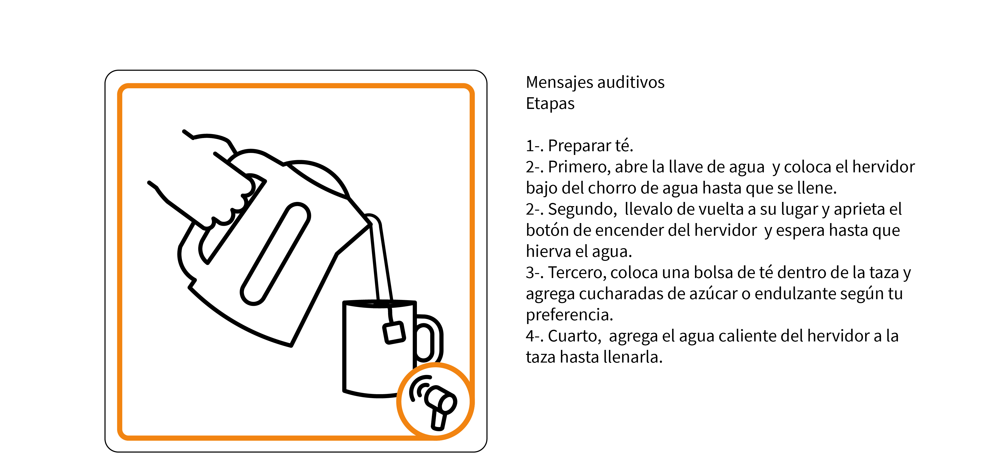
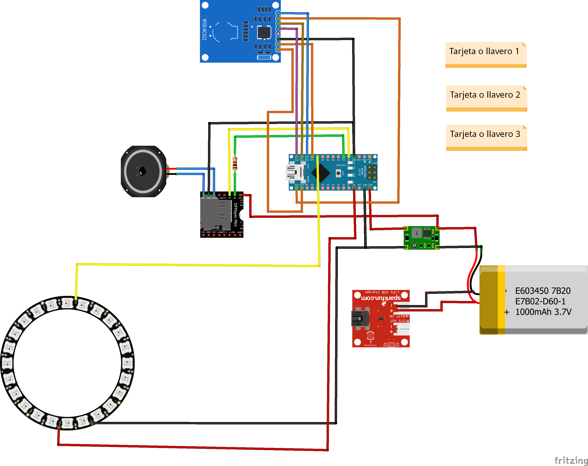
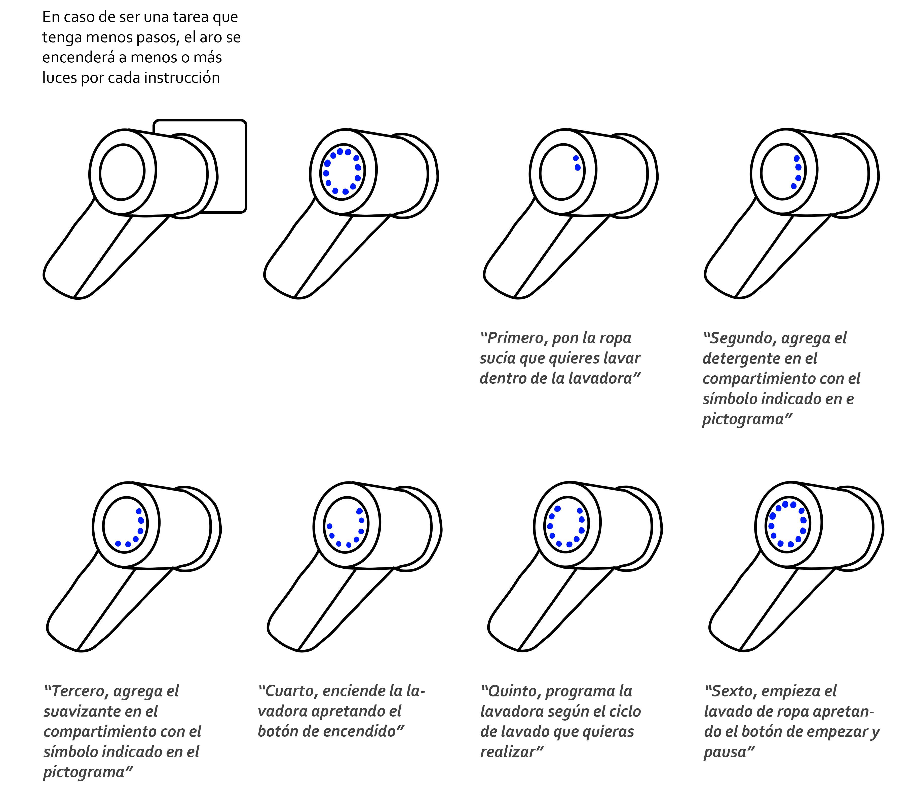
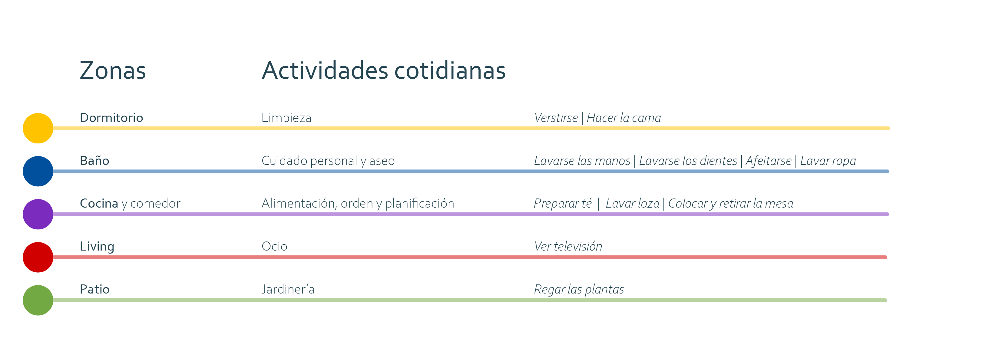

# Lectogram

## Contexto

[Para mayor información acerca de la investigación realizada en el proyecto Envejecimiento activo y discapacidad intelectual haga click aquí](https://wiki.ead.pucv.cl/Proyecto_Envejecimiento_activo_y_discapacidad_intelectual_2020)

En base a un estudio e investigación realizada y los resultados obtenidos a partir de esta, se plantearon una serie de conceptos de diseño con la finalidad de potenciar el envejecimiento activo y la vida independiente de las personas con discapacidad intelectual (DI) en proceso de envejecimiento. 

Este público representa un gran desafío ya que posee un acelerado deterioro de sus capacidades motrices, cognitivas y físicas a comparación con las personas sin DI, lo que se suma a ser una población históricamente vulnerada en la realidad latinoamericana y de Chile.

La propuesta de diseño se desarrolla bajo una perspectiva de diseño centrado en el usuario (DCU), donde se realizan validaciones de los conceptos de diseño con actores relevantes (adulto mayor con DI, cuidadores profesionales y cuidadores familiares) para encontrar los conceptos más aplicables y necesarios en la vida de los usuario, siendo la propuesta **un sistema de apoyo para la comprensión de los espacios** y el lector de pictogramas, resulto ser uno de los tres conceptos con mayor aprobación por adultos con D.I. 

## Apoyo a la interpretación de pictogramas

[Para ingresar al repositorio de GitHub de Lectogram haga click aquí](https://github.com/accesibilidad-inclusion/lectogram/tree/gh-pages)

Lectogram consiste en un **apoyo tecnológico**, que facilita la comprensión de los espacios que lo rodean, identificando lugares específicos y objetos con los que pueden realizar actividades de la vida cotidiana, mediante **apoyos visuales y auditivos**.

Esta diseñado particularmente para adultos con Discapacidad intelectual que se encuentran en etapa de envejecimiento. El apoyo visual consiste en **un set de pictogramas** diseñados específicamente para personas con discapacidad intelectual, enfocados en las tareas del hogar.

El apoyo auditivo funciona a través la interacción con el pictograma, Lectogram entrega un mensaje de voz que ayuda a la realización de actividades relacionadas con el hogar. Lectogram se piensa como un objeto portable y manipulable para el usuario ya que este se tiene que acercar y tener contacto con el pictograma para su activación y entregar el apoyo auditivo instructivo de como hacer las actividad de forma general.







### Pictogramas

El uso del aparato va relacionado a la presencia de diversos pictogramas *-que se ubican dentro de la casa-*  que apoyan la realización de actividades cotidianas dentro del hogar, los cuales consisten en una descripción gráfica de la actividad a realizarse.



### Sistema electrónico

El sistema electrónico del prototipo Lectogram se basa principalmente en la lectura de tarjetas que se ubican en el lugar habitado en forma de pictogramas, dicha lectura se realiza a través del sensor del aparato, dentro del cual, al realizar la acción de leer la tarjeta, se  reproducen, por medio de un parlante, las instrucciones del la actividad asociada al pictograma escaneado, como apoyo a la instrucciones por audio, un aro de luz rectifica la acción que se esta realizando, y categoriza las zonas por colores designados. 


La lectura de tarjetas corresponde a una tecnología de identificación por radio-frecuencia (RFID), la cual se utiliza comúnmente en los ingresos a accesos de edificios con seguridad, y también en versiones a larga distancia se puede encontrar en los 'tag' que utilizan los autos en autopistas de ciudades.

*En la imagen se muestra el sistema electrónico del aparato para su funcionamiento*

[Para mayor información acerca del trabajo realizado sobre el primer prototipo formal de Lectogram  haga click aquí](https://wiki.ead.pucv.cl/Proyecto_Fondecyt:_Apoyos_a_la_vida_independiente)

##Validación interna
Tras la revisión del primer prototipo formal, se propone un proceso de validación, una evaluación que conste de tres niveles, comenzando con una **validación interna por parte del equipo desarrollador de los prototipos**, para luego dar cabida a una **evaluación por parte del G.A *-grupo asesor-*** y finalmente terminar con una **evaluación en residencias**. 

Lo que se busca con esto, es que entre evaluaciones se puedan ir aplicando mejoras según las experiencias de cada usuario que lo testee, y que de esta manera, pueda llegar a un estado óptimo en cuanto a diseño y funcionalidad. 

Tras la revisión inicial, se detectan los siguientes **problemas**: 

El aro de luz muestra colores que se encuentran asignados al azar, por lo que no se comprende la funcionalidad de estas. 

Velocidad de los audios, las instrucciones pasan una a continuación de otra sin pausas entre estas, entorpeciendo la comprensión.

El volumen del artefacto es muy bajo.

Para los que se aplican las siguientes **mejoras**:

Las instrucciones por audio se dividirán por los pasos que cada actividad contiene, otorgándole pausas a esta y facilitando la comprensión de cada tarea.

El aro de luz verificará el avance de las instrucciones, mediante el avance de luz en conjunto al avance de cada instrucción. 

*En la imagen se muestra la secuencia que seguiría el aro de luz en conjunto con la entrega de la instrucción*

Categorización de las zonas de la casa por colores establecidos al momento de escanear y reconocer los espacios en que se encuentran cada pictograma.

*En la imagen se muestra la categorización de zonas de la casa*

Re-diseño de la carcasa para lograr un mejor ensamble de esta y generar en ella un  espacio  destinado al sistema electrónico. 













